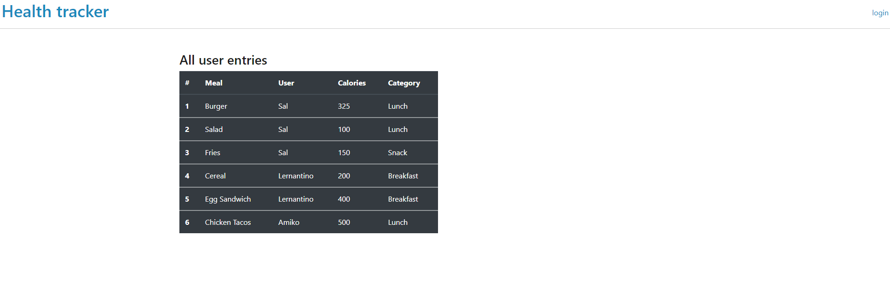

# Title: Health Tracker

## Purpose
As a(n): individual concerned with health
	I’d like to: count my meals and calories
	So I could: live a healthier life.

## Instructions:

A web application that allows users to login and enter in meal data (meal name, meal type, calorie count) and allows them to view daily totals

## Built Using:
- Heroku
- Sequelize
- SQL Workbench
- Handlebars
- RESTful

## Screenshots:

## Install

- .env (database, username, password)
- create database (run from db folder sequel queries)
- npm i
- npm run seed
- <KBD>npm run start</KBD>

## Credits:
Built by: Alex Ortiz, Pravesh Mukhi, Junior Mizhquiri and Rafiun Nessa.

## Link to Page: 
https://project2-health-tracker.herokuapp.com/
